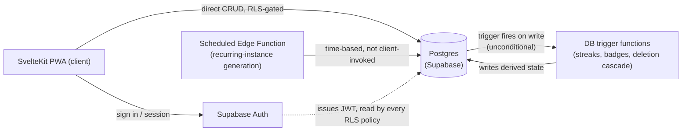
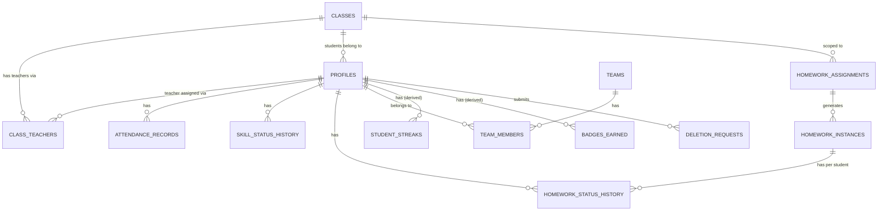

# Architecture Spine — Sherab Architecture Spine

## Design Paradigm

**RLS-Gated Direct-Access BaaS with Function Sidecar.** The SvelteKit client talks to a single Supabase Postgres project directly via its client SDK — there is no hand-rolled REST/GraphQL layer. Two enforcement lanes:

- **Direct lane** — plain CRUD (attendance marks, homework creation, Done/Reviewed toggles, registration requests) flows straight from client to Postgres, authorized entirely by Row Level Security policies.
- **Function-sidecar lane** — anything the system *computes or awards* (streaks, badges, deletion cascade) is written only by a **DB trigger** reacting to the underlying write, never by the client directly and never dependent on the client remembering to invoke anything. The one exception is genuinely time-based work with no triggering write — recurring-assignment generation — which runs as a scheduled Edge Function instead (AD-3, AD-8). Leaderboard rank is neither: it's a read-time computed view, not stored state at all.



## Invariants & Rules

### AD-1 — Stack & access paradigm

- **Binds:** all
- **Prevents:** divergent backend choices per feature; an ad hoc REST layer growing up alongside direct DB access
- **Rule:** All persistence goes through one Supabase Postgres project. Client code talks to Supabase directly via its SDK — no custom REST/GraphQL layer is introduced. SvelteKit serves the frontend as an installable PWA.

### AD-2 — Authorization enforcement boundary

- **Binds:** CAP-1, CAP-2, CAP-3, CAP-7
- **Prevents:** a feature checking permissions in frontend code, which a tampered client can bypass
- **Rule:** All authorization is enforced by Postgres Row Level Security policies keyed on the authenticated user's identity/role. Frontend code may hide UI for a role but is never the sole barrier to an action.

### AD-3 — Computed/awarded state ownership

- **Binds:** CAP-3 (recurring generation), CAP-4 (streaks), CAP-5 (badges), CAP-8 (deletion cascade)
- **Prevents:** a tampered or buggy client writing a fabricated computed value (e.g. self-awarding a badge, forging a streak); a client that never calls the "right" function leaving derived state permanently stale (e.g. a badge silently never awarded)
- **Rule:** Any derived-state write that reacts to a data change (streak recompute, badge award, deletion cascade) is a **DB trigger on the source table's write** — never a client-invoked Edge Function — so it fires unconditionally, regardless of client behavior. Edge/scheduled functions are reserved only for genuinely time-based work with no triggering row-write (recurring-assignment instance generation, AD-8). Derived counts (streak length, badge-milestone crossing) count **distinct `(student_id, homework_instance_id)` pairs that reached Done**, never raw history-row counts — a student's self-mark and a teacher's on-behalf-of mark for the same instance (both legal under AD-5) must not double-count.
- Leaderboard rank is explicitly **not** derived/stored state (see Structural Seed) — it is a read-time computed view, so it isn't bound by this AD.

### AD-4 — Identity & role model

- **Binds:** CAP-1, CAP-2, CAP-6, CAP-7
- **Prevents:** divergent, ad hoc "who can see this class" checks scattered per feature or table; a routine update silently reshuffling a student's fixed-for-the-year team
- **Rule:** Supabase Auth is the sole identity provider. A `profiles` table (PK = auth user id) carries `role`. A `class_teachers` join table expresses many-to-many teacher↔class assignment. Every RLS policy needing a class- or role-scoped check resolves through these two tables — never a locally invented check. A student's `team_id` may only be set **from `NULL`** through the normal client update path (matching SPEC.md's "teams fixed for the school year, no reshuffling"); changing an already-set `team_id` requires an explicit admin-only override path, not a routine update.

### AD-5 — History-as-append

- **Binds:** CAP-2 (skill status), CAP-3 (homework Done/Reviewed transitions), CAP-4 (attendance)
- **Prevents:** two features disagreeing on "current value"; losing the substitute-teacher continuity SPEC.md requires
- **Rule:** Skill-status changes, attendance marks, and homework status transitions insert new append-only rows — never update a row in place. "Current" is always the latest row by timestamp for that (student, subject) pair.

### AD-6 — Deployment & environments

- **Binds:** all
- **Prevents:** building CI/CD or staging infrastructure disproportionate to a volunteer-run project
- **Rule:** The frontend deploys as a static/SSR SvelteKit build to a free-tier static host (e.g. Cloudflare Pages). The backend is the single managed Supabase project — no self-hosted infrastructure. One production environment plus local development against a separate dev Supabase project; a staging environment is deferred (see Deferred). Supabase free-tier projects auto-pause after 7 days with zero activity — since usage is weekly-concentrated (Sunday classes) and school holidays can exceed that, this is an accepted operational quirk, not a defect: the admin restores it with one dashboard click (~60s cold start) rather than the project running an automated keep-alive ping.

### AD-7 — Ownership & portability

- **Binds:** NFR ownership constraint
- **Prevents:** hosting, domain, or admin access becoming tied to one individual's personal account
- **Rule:** The Supabase project, hosting account, and domain are created under an organization-owned account (e.g. a dedicated school email/org) — never an individual maintainer's personal account.

### AD-8 — Recurring-instance integrity

- **Binds:** CAP-3
- **Prevents:** a direct client insert creating a duplicate `homework_instances` row for a period the recurrence sidecar already generated
- **Rule:** A `UNIQUE(assignment_id, period_start)` constraint on `homework_instances` rejects duplicates at the database level. RLS additionally restricts direct client inserts into `homework_instances` to assignments where `recurrence_rule IS NULL` (one-off) — instances for a recurring assignment can only be created by the scheduled generation function's trusted connection.

### AD-9 — Deletion audit vs. erasure

- **Binds:** CAP-8
- **Prevents:** "all of that student's records are gone" silently destroying the only record that an approved deletion ever happened, leaving no accountability trail for an irreversible admin action
- **Rule:** The `deletion_requests` row survives the cascade but is de-identified — its `student_id` reference is replaced with a non-identifying placeholder once the cascade completes, while `admin_id`/`requested_at`/`approved_at` remain as a minimal accountability trail. This is the one explicit carve-out to "all records gone"; every other table is a hard delete.

## Consistency Conventions

| Concern | Convention |
| --- | --- |
| Naming (entities, files, interfaces, events) | `snake_case` for DB tables/columns; kebab-case routes; `PascalCase` Svelte components |
| Data & formats (ids, dates, error shapes, envelopes) | UUID primary keys (Supabase default); all timestamps `timestamptz` in UTC; dates as ISO 8601 |
| State & cross-cutting (mutation, errors, logging, config, auth) | Supabase Auth JWT is the only identity token; admin-tunable values (streak grace period, badge milestone step, homework look-ahead window) live in an `app_settings` table, never a hardcoded constant; UI strings keyed through **Paraglide (Inlang)**, never inline literals (corrected 2026-09-13 sprint-planning readiness pass — this table previously said `svelte-i18n`, contradicting the Stack table and `src/messages/` layout, which both already specify Paraglide) |

## Stack

| Name | Version |
| --- | --- |
| SvelteKit | **2.x, pinned** — @vite-pwa/sveltekit has no confirmed SvelteKit 3 support as of this writing (SvelteKit 3 was at RC); re-verify before crossing to 3.x |
| Supabase (Postgres + Auth + Storage + Edge Functions) | managed, current |
| @vite-pwa/sveltekit | latest v1.x (confirmed current, Sep 2026; peer range covers SvelteKit 1-2 only) |
| Paraglide (Inlang) | latest, via `svelte add paraglide` — replaces svelte-i18n (stale since Oct 2024, unconfirmed runes support, ~4.5x heavier bundle) |
| Hosting | Cloudflare Pages free tier |

## Structural Seed



Entity names and relationships only — column-level shape is seed the code owns once migrations exist. `STUDENT_STREAKS` and `BADGES_EARNED` are derived tables, written only by DB triggers (AD-3), never by direct client writes. `APP_SETTINGS` (admin-tunable values, not shown above — no relationships to other entities) is a flat key/value table. **Team leaderboard rank is deliberately absent from this ERD** — it is a read-time computed view over `TEAM_MEMBERS` + `STUDENT_STREAKS` (`SUM` of member streaks per team), never a stored column, so a deleted member simply drops out of the next read instead of requiring an owner to keep an aggregate in sync.

```text
src/
  routes/            # SvelteKit pages, one tree per role (admin/, teacher/, student/)
  lib/
    supabase/         # generated types + typed client wrapper
    components/       # shared UI
  messages/            # Paraglide message files (de, en, bo)
supabase/
  migrations/         # schema + RLS policies + DB triggers, source of truth for the data layer
  functions/           # scheduled Edge Functions (recurring-instance generation only, AD-8)
```

## Capability → Architecture Map

| Capability | Lives in | Governed by |
| --- | --- | --- |
| CAP-1 Account & registration | `profiles`, `class_teachers`, direct-lane RLS | AD-2, AD-4 |
| CAP-2 Roster & skill tracking | `attendance_records`, `skill_status_history`, direct-lane RLS | AD-2, AD-4, AD-5 |
| CAP-3 Homework assignment & tracking | `homework_assignments`, `homework_instances` (direct-lane, UNIQUE-constrained), `homework_status_history` (direct-lane) + scheduled recurrence-generation function | AD-2, AD-3, AD-5, AD-8 |
| CAP-4 Streaks | `student_streaks`, trigger-written only | AD-3 |
| CAP-5 Badges | `badges_earned`, trigger-written only | AD-3 |
| CAP-6 Team leaderboard | `teams`, `team_members` (direct-lane, set-once `team_id`) + rank as a read-time view, never stored | AD-2, AD-3, AD-4 |
| CAP-7 Admin oversight | cross-class read via admin-role RLS policy; reuses CAP-1's approval mechanism | AD-2, AD-4 |
| CAP-8 Data privacy & deletion | `deletion_requests` (direct-lane submit) + deletion-cascade trigger (on admin approval), row retained de-identified | AD-2, AD-3, AD-9 |

## Deferred

- **Column-level schema** — table shapes beyond the ERD's names/relationships are seed, owned by migrations once written, not this spine.
- **Badge milestone step size** (every 5 vs. every 10) — open question carried from SPEC.md; resolve before Story 6.
- **Recurring-assignment scheduling mechanism** (`pg_cron` vs. a scheduled Edge Function) — an implementation detail for Story 4, not an architectural invariant.
- **Staging environment** — deferred until there's a second maintainer or usage beyond the free tier; revisit then.
- **Offline sync** — explicit SPEC.md non-goal for v1.
- **UI/UX design system** — owned by `bmad-ux`, not this spine.
- **Native app-store packaging** — not needed for v1 (SPEC.md constraint, and PWA was chosen after weighing Flutter — see memlog). If ever wanted later, the lowest-cost path is wrapping the existing PWA (e.g. via a PWA-to-store tool or Capacitor) rather than a rewrite; not designed in now.
