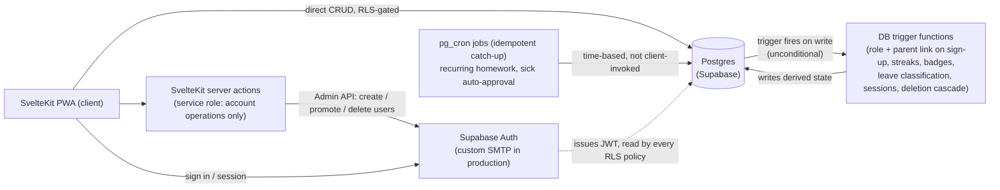
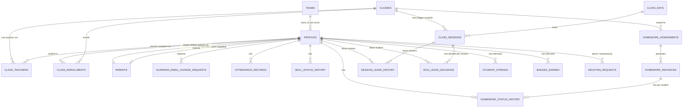

# Architecture Spine — Sherab Architecture Spine

## Design Paradigm

**RLS-Gated Direct-Access BaaS with Function Sidecar.** The SvelteKit client talks to a single Supabase Postgres project directly via its client SDK — there is no hand-rolled REST/GraphQL layer. Two enforcement lanes:

- **Direct lane** — plain CRUD (attendance marks, homework creation, Done/Reviewed toggles, session leave, registration requests) flows straight from client to Postgres, authorized entirely by Row Level Security policies.
- **Function-sidecar lane** — anything the system *computes or awards* (streaks, badges, leave classification, deletion cascade, calendar sessions) is written only by a **DB trigger** reacting to the underlying write, never by the client directly and never dependent on the client remembering to invoke anything. The exceptions are genuinely time-based jobs with no triggering write — recurring-assignment generation and Sick-leave auto-approval — which run on `pg_cron` (AD-3, AD-8, AD-13). Leaderboard rank is neither: it's a read-time computed view, not stored state at all.

Account operations that must bypass RLS (creating a student's or parent's auth user, promoting a login, minting credentials) run in SvelteKit server actions holding the service-role key — the only server-side code path, and never a general API (AD-1, AD-11).


```mermaid
flowchart LR
  Client["SvelteKit PWA (client)"] -- "direct CRUD, RLS-gated" --> DB[("Postgres\n(Supabase)")]
  Client --> Server["SvelteKit server actions\n(service role: account operations only)"]
  Server -- "Admin API: create / promote / delete users" --> Auth
  DB -- "trigger fires on write\n(unconditional)" --> TRG["DB trigger functions\n(role + parent link on sign-up, streaks, badges,\nleave classification, sessions, deletion cascade)"]
  TRG -- "writes derived state" --> DB
  SCHED["pg_cron jobs (idempotent catch-up)\nrecurring homework, sick auto-approval"] -- "time-based, not client-invoked" --> DB
  Auth["Supabase Auth\n(custom SMTP in production)"] -. "issues JWT, read by every RLS policy" .-> DB
  Client -- "sign in / session" --> Auth
```

## Invariants & Rules

### AD-1 — Stack & access paradigm

- **Binds:** all
- **Prevents:** divergent backend choices per feature; an ad hoc REST layer growing up alongside direct DB access
- **Rule:** All persistence goes through one Supabase Postgres project. Client code talks to Supabase directly via its SDK — no custom REST/GraphQL layer is introduced. SvelteKit serves the frontend as an installable PWA. SvelteKit server actions may use the service-role key only for auth-account operations RLS can't express (AD-4, AD-11), never as a general data layer.

### AD-2 — Authorization enforcement boundary

- **Binds:** CAP-1, CAP-2, CAP-3, CAP-7, CAP-11, CAP-12, CAP-13
- **Prevents:** a feature checking permissions in frontend code, which a tampered client can bypass
- **Rule:** All authorization is enforced by Postgres Row Level Security policies keyed on the authenticated user's identity/role. Frontend code may hide UI for a role but is never the sole barrier to an action.

### AD-3 — Computed/awarded state ownership

- **Binds:** CAP-3 (recurring generation), CAP-4 (streaks), CAP-5 (badges), CAP-8 (deletion cascade), CAP-10 (sessions), CAP-11 (leave classification, sick auto-approval)
- **Prevents:** a tampered or buggy client writing a fabricated computed value (e.g. self-awarding a badge, forging a streak, marking short-notice leave as planned); a client that never calls the "right" function leaving derived state permanently stale; two features computing the streak differently
- **Rule:** Any derived-state write that reacts to a data change (streak recompute, badge award, leave classification, session generation, deletion cascade) is a **DB trigger on the source table's write** — never a client-invoked Edge Function — so it fires unconditionally, regardless of client behavior. Scheduled jobs (`pg_cron`) are reserved for genuinely time-based work with no triggering row-write: recurring-assignment instance generation (AD-8) and Sick-leave auto-approval (AD-13). Derived counts (streak length, badge-milestone crossing) count **distinct `(student_id, homework_instance_id)` pairs that reached Done**, never raw history-row counts. `recompute_student_streak` is the **single** streak path: triggers on `attendance_records`, `homework_status_history`, `session_leave_history`, `sick_leave_decisions`, and `class_sessions` cancellation all call it, and a missed session is protected only by Planned leave or approved Sick leave (SPEC CAP-4).
- Leaderboard rank is explicitly **not** derived/stored state (see Structural Seed) — it is a read-time computed view, so it isn't bound by this AD.

### AD-4 — Identity & role model

- **Binds:** CAP-1, CAP-2, CAP-6, CAP-7, CAP-12, CAP-13
- **Prevents:** a client granting itself a privileged role at sign-up; divergent "who can see this class" or "is this a parent" checks per feature; two features encoding the Teacher/Admin + Parent dual role differently; a route guard that locks out a teacher-parent or lets a pending parent in; a teacher approving or deciding anything about their own child; a routine update reshuffling a student's fixed-for-the-year team
- **Rule:**
  - Supabase Auth is the sole identity provider. `profiles` (PK = auth user id) carries the login's **primary** `role` (`admin`, `teacher`, `student`, or `parent` for a parent-only login). Privileged roles (`admin`, `teacher`, `student`) are set only from `raw_app_meta_data` or the Admin API — **never from client-supplied `raw_user_meta_data`**. Client metadata may carry at most `parent`, and a sign-up with no valid role is refused, never defaulted to `teacher` (existing hole logged as issue #50).
  - **Parent capability is held only by an approved row in `parents`** (PK = auth user id, `pending`/`approved`/`rejected`, approvable only after the email is confirmed) — never inferred from `profiles.role`. A parent-only login is created by a server action. A signed-in teacher or admin requests parent capability by an RLS-guarded insert of their own `pending` row. When the admin creates a teacher whose email already has a parent-only login, that login is promoted, not duplicated. Rejecting a parent deletes the `parents` row and, for a parent-only login, the auth user, so the email can register again.
  - Every RLS check resolves through the shared helpers `is_admin()`, `is_teacher_of_class()`, `is_parent()`, `is_parent_of(student_id)` (caller holds an approved `parents` row, the student's `parent_id` is the caller, and the student is approved), and `is_parent_in_class(class_id)` — never a locally invented check. `linked_children()` returns the caller's pending and approved children (name and status only) for the landing page; rejected children are excluded.
  - RLS evaluates the union of everything a login holds; the role switcher is presentation only. Route guards read one `getCapabilities()` helper (primary role + parent status), never `profiles.role` alone.
  - No approval or decision about a student (registration, Sick leave, guardian email change, deletion) is accepted from an actor who `is_parent_of` that student — enforced in the policy's `WITH CHECK`.
  - A student's `team_id` may only be set **from `NULL`** through the normal client update path; changing an already-set `team_id` requires an explicit admin-only override path.

### AD-5 — History-as-append

- **Binds:** CAP-2 (skill status), CAP-3 (homework Done/Reviewed transitions), CAP-4 (attendance), CAP-8 (deletion requests), CAP-11 (session leave, sick decisions), CAP-1 (guardian email change requests)
- **Prevents:** two features disagreeing on "current value"; losing the substitute-teacher continuity SPEC.md requires; a client back-dating a leave answer or forging who made a decision
- **Rule:** Skill-status changes, attendance marks, homework status transitions, session-leave answers, Sick-leave decisions, and request rows insert new append-only rows — never update a row in place. "Current" is always the latest row by timestamp for that subject (student + skill area, student + session, …). On every such table a BEFORE INSERT trigger overwrites the actor and time columns (`*_by`, `*_at`) with `auth.uid()` and `now()`; clients never supply them, and every cutoff compares against `now()`.

### AD-6 — Deployment, environments & operations

- **Binds:** all
- **Prevents:** building CI/CD or staging infrastructure disproportionate to a volunteer-run project; parents never receiving their confirmation email; a scheduled job silently skipping work while the project was paused
- **Rule:** The frontend deploys as a static/SSR SvelteKit build to a free-tier static host (e.g. Cloudflare Pages). The backend is the single managed Supabase project — no self-hosted infrastructure. One production environment plus local development against a separate dev Supabase project; a staging environment is deferred. Supabase free-tier projects auto-pause after 7 days with zero activity; this is an accepted quirk, the admin restores the project from the dashboard, and the org inbox that receives Supabase's pause warnings is monitored. Paused projects skip `pg_cron` runs and never replay them, so **every scheduled job is an idempotent catch-up**: it processes everything due, not just what fell due today. Production Auth email (parent confirmation, password reset) goes through **custom SMTP** under the org account with a raised Auth email rate limit; Supabase's built-in sender is for development only.

### AD-7 — Ownership & portability

- **Binds:** NFR ownership constraint
- **Prevents:** hosting, domain, email, or admin access becoming tied to one individual's personal account
- **Rule:** The Supabase project, hosting account, SMTP provider, and domain are created under an organization-owned account (e.g. a dedicated school email/org) — never an individual maintainer's personal account.

### AD-8 — Recurring-instance integrity

- **Binds:** CAP-3
- **Prevents:** a direct client insert creating a duplicate `homework_instances` row for a period the recurrence sidecar already generated
- **Rule:** A `UNIQUE(assignment_id, period_start)` constraint on `homework_instances` rejects duplicates at the database level. RLS additionally restricts direct client inserts into `homework_instances` to assignments where `recurrence_rule IS NULL` (one-off) — instances for a recurring assignment can only be created by the scheduled generation job's trusted connection.

### AD-9 — Deletion audit vs. erasure

- **Binds:** CAP-8
- **Prevents:** "all of that student's records are gone" silently destroying the only record that an approved deletion ever happened; a parent-submitted request taking a different path from a student-submitted one
- **Rule:** One `deletion_requests` queue serves both submitters; each row records `requested_by` (the student, or their parent checked by `is_parent_of`). The cascade is a trigger on the admin's approval of the request. The row survives the cascade but is de-identified — `student_id`, and `requested_by` when it was the student, are replaced with a non-identifying placeholder, while the submitter's role, `admin_id`, `requested_at`, and `approved_at` remain as a minimal accountability trail. This is the one explicit carve-out to "all records gone"; every other student-owned table is a hard delete. The parent's own account is not part of the cascade.

### AD-10 — Parent↔child link

- **Binds:** CAP-1, CAP-12, CAP-13
- **Prevents:** a live email-text match drifting on case/whitespace or a guardian-email typo; RLS policies matching emails; a child silently moving to another parent; deleting a parent account wiping children without admin approval
- **Rule:** The link is a stored foreign key `profiles.parent_id → parents.id` with `ON DELETE RESTRICT`, set once at sign-up (AD-11). RLS never matches on email text; `guardian_email` stays on the profile as a display copy only. `parent_id`, `guardian_email`, and `role` are writable only by trusted paths (a guard trigger rejects any other change, including through the teacher's registration-review update). `parent_id` changes only when the admin approves a `guardian_email_change_requests` row, whose trigger applies the new email and new `parent_id` together.

### AD-11 — Student registration identity

- **Binds:** CAP-1, CAP-12
- **Prevents:** Supabase Auth's unique-email rule colliding between siblings and their parent; anonymous visitors reading `parents`; a student created without a parent because the check and the insert ran separately; Auth sending mail to a synthetic address
- **Rule:** A student's auth user carries a synthetic email (the existing student email domain) from the moment they register, created by a server action through the Admin API with the email pre-confirmed and a random, unshared password; real login credentials are minted at teacher approval, as today. The parent match happens **inside the auth-user insert trigger**: it sets `parent_id` or raises, rolling back the whole sign-up. The server action's pre-check exists only to show the "No parent account found" message and returns only found/not-found. Student approval no longer requires `email_confirmed_at`; the 0006 guardian-email confirmation flow is retired.

### AD-12 — Parent read access

- **Binds:** CAP-13
- **Prevents:** a parallel parent read path drifting from the child's view; a parent gaining write access through reused student policies; a parent seeing another child's name, leave, or progress
- **Rule:** Parent reads are granted per table:
  - **Student-keyed tables** (`homework_status_history`, `student_streaks`, `badges_earned`, `class_enrollments`, `attendance_records`, `skill_status_history`) add `or is_parent_of(student_id)` to their SELECT policies, creating a parent SELECT policy where no student-scoped one exists. Parents see `skill_status_history.notes`; [ASSUMPTION] `attendance_records.notes` stay teacher-only.
  - **Class-keyed tables** (`classes`, `class_sessions`, homework assignments and instances via the targeting helpers) use `is_parent_in_class(class_id)`.
  - **Classmates are never returned to a parent:** the parent variant of `class_people` returns teachers only, and the masked leave function (AD-14) excludes parents. The leaderboard shows team totals only.
  - Functions that treat `auth.uid()` as "the student" take an explicit student id and check self-or-parent. Open and Overdue counts come from one `homework_counts(student_id)` function shared by the student page, the parent card, and the admin view.
  - Parents get **no** INSERT/UPDATE/DELETE policy anywhere except `session_leave_history` (AD-13), `deletion_requests` (AD-9), and their own `parents` request (AD-4).

### AD-13 — Session leave

- **Binds:** CAP-4, CAP-11
- **Prevents:** a client marking short-notice leave as planned; a student setting their own leave; a parent re-submitting Sick after a rejection to get it auto-approved; pending Sick leave being forgotten forever
- **Rule:**
  - Leave lives in `session_leave_history` (append-only, keyed by `class_session_id` + `student_id`: `coming` / `on_leave` / `sick`). Only `is_parent_of(student_id)` may insert. The database enforces the cutoffs using AD-15's session start: `coming`/`on_leave` until the session starts, `sick` until the end of the following day (Europe/Berlin). A BEFORE INSERT trigger stamps `planned` / `short_notice` via `classify_leave()`; the client never supplies it.
  - Sick decisions live in `sick_leave_decisions`, keyed by `(class_session_id, student_id)` — not by a leave row — and are made by any teacher of the class or the admin (subject to AD-4's self-approval guard). [ASSUMPTION] A rejection is final for that session.
  - A daily `pg_cron` catch-up job approves every undecided Sick answer whose session started at least 14 days ago, recorded with a system actor.
  - Leave rows of a session deleted by schedule regeneration are deleted with it ([ASSUMPTION]; regeneration only touches future sessions). This replaces story 6-3's student-set leave.
- [ASSUMPTION] The classification is frozen at insert: changing the notice period later or moving the session doesn't reclassify existing leave. PRD Open Question 4 is still open; revisit when it's decided.

### AD-14 — Sick masking

- **Binds:** CAP-11
- **Prevents:** a classmate or team view reading the raw leave table and leaking that a child is Sick
- **Rule:** SELECT on `session_leave_history` and `sick_leave_decisions` is limited to the student, their parent, the class's teachers, and the admin. Classmates and teammates read leave only through one security-definer function that checks the caller is an enrolled classmate or teammate, returns only session, student display name, and answer, and returns `sick` as `on_leave`. No view or policy grants classmates the base table.

### AD-15 — Session timing single source

- **Binds:** CAP-10, CAP-11
- **Prevents:** the FR-9 "Planned or Short-Notice" preview disagreeing with what the database stores; cutoffs computed differently in the UI, the insert trigger, and the auto-approval job
- **Rule:** One SQL function `session_starts_at(class_session_id)` resolves a session's start (session override, else class default, in Europe/Berlin). `classify_leave()` (used by the insert trigger) and `preview_leave()` (the RPC the UI calls before saving) both build on it; no other code computes session start, cutoffs, or classification. [ASSUMPTION] A session with no time set starts at 00:00 local on its day.

## Consistency Conventions

| Concern | Convention |
| --- | --- |
| Naming (entities, files, interfaces, events) | `snake_case` for DB tables/columns; kebab-case routes; `PascalCase` Svelte components |
| Data & formats (ids, dates, error shapes, envelopes) | UUID primary keys (Supabase default); all timestamps `timestamptz` in UTC; dates as ISO 8601; session times and leave cutoffs evaluated in Europe/Berlin |
| State & cross-cutting (mutation, errors, logging, config, auth) | Supabase Auth JWT is the only identity token; admin-tunable values (streak grace period, leave notice period, badge milestone step, homework look-ahead window) live in `app_settings`, never a hardcoded constant; UI strings keyed through **Paraglide (Inlang)**, never inline literals |
| Database functions | New `security definer` functions pin `set search_path = ''`, check the caller inside, return only the needed columns, and grant `EXECUTE` explicitly (revoked from `public`/`anon`). Existing functions keep their current form. |

## Stack

| Name | Version |
| --- | --- |
| SvelteKit | **2.x, pinned** — @vite-pwa/sveltekit's peer range is still `^1.3.1 \|\| ^2.0.1` and SvelteKit 3 is pre-release (re-verified 2026-09-26); re-verify before crossing to 3.x |
| Supabase (Postgres + Auth + Storage + `pg_cron`) | managed, current |
| @vite-pwa/sveltekit | 1.x (1.1.0 current, re-verified 2026-09-26) |
| Paraglide (Inlang) | 2.x, via `svelte add paraglide` |
| Hosting | Cloudflare Pages free tier |

## Structural Seed


```mermaid
erDiagram
  PROFILES ||--o{ CLASS_TEACHERS : "teacher assigned via"
  CLASSES ||--o{ CLASS_TEACHERS : "has teachers via"
  CLASSES ||--o{ CLASS_ENROLLMENTS : "enrolls"
  PROFILES ||--o{ CLASS_ENROLLMENTS : "student in"
  PROFILES ||--o| PARENTS : "may hold parent capability"
  PARENTS ||--o{ PROFILES : "linked children (parent_id, restrict)"
  PROFILES ||--o{ GUARDIAN_EMAIL_CHANGE_REQUESTS : "requests"
  PROFILES ||--o{ ATTENDANCE_RECORDS : "has"
  PROFILES ||--o{ SKILL_STATUS_HISTORY : "has"
  CLASSES ||--o{ HOMEWORK_ASSIGNMENTS : "scoped to"
  HOMEWORK_ASSIGNMENTS ||--o{ HOMEWORK_INSTANCES : "generates"
  HOMEWORK_INSTANCES ||--o{ HOMEWORK_STATUS_HISTORY : "has per student"
  PROFILES ||--o{ HOMEWORK_STATUS_HISTORY : "has"
  CLASS_DAYS ||--o{ CLASS_SESSIONS : "hosts"
  CLASSES ||--o{ CLASS_SESSIONS : "has (trigger-created)"
  CLASS_SESSIONS ||--o{ SESSION_LEAVE_HISTORY : "leave answers"
  PROFILES ||--o{ SESSION_LEAVE_HISTORY : "about student"
  CLASS_SESSIONS ||--o{ SICK_LEAVE_DECISIONS : "sick decided per session"
  PROFILES ||--o{ SICK_LEAVE_DECISIONS : "about student"
  TEAMS ||--o{ PROFILES : "team_id (set once)"
  PROFILES ||--o{ STUDENT_STREAKS : "has (derived)"
  PROFILES ||--o{ BADGES_EARNED : "has (derived)"
  PROFILES ||--o{ DELETION_REQUESTS : "about / requested by"
```

Entity names and relationships only — column-level shape is seed the code owns once migrations exist. `STUDENT_STREAKS`, `BADGES_EARNED` and `CLASS_SESSIONS` are written only by DB triggers (AD-3). `APP_SETTINGS` (admin-tunable values, not shown) is a flat key/value table. **Team leaderboard rank is deliberately absent** — it is a read-time computed view (`SUM` of member streaks per team), never a stored column. `PARENTS`, `DELETION_REQUESTS`, `GUARDIAN_EMAIL_CHANGE_REQUESTS` and the leave tables are not built yet; `ATTENDANCE_RECORDS` is still keyed by `session_date` until story 6-2 re-keys it to sessions.

```text
messages/              # Paraglide message files (de, en, bo)
src/
  routes/            # SvelteKit pages, one tree per role (admin/, teacher/, student/, parent/)
  lib/
    supabase/         # generated types + typed client wrapper
    server/           # server-only helpers (getCapabilities, service-role account operations)
    components/       # shared UI
supabase/
  migrations/         # schema + RLS policies + DB triggers + pg_cron jobs, source of truth for the data layer
```

## Capability → Architecture Map

| Capability | Lives in | Governed by |
| --- | --- | --- |
| CAP-1 Account & registration | `profiles`, `class_teachers`, sign-up trigger, server-action account operations, `guardian_email_change_requests` | AD-2, AD-4, AD-5, AD-10, AD-11 |
| CAP-2 Roster & skill tracking | `attendance_records`, `skill_status_history` (notes visible to parent), direct-lane RLS | AD-2, AD-4, AD-5, AD-12 |
| CAP-3 Homework assignment & tracking | `homework_assignments`, `homework_instances` (UNIQUE-constrained), `homework_status_history` + `pg_cron` recurrence job; `homework_counts()` | AD-2, AD-3, AD-5, AD-8, AD-12 |
| CAP-4 Streaks | `student_streaks`, written only by `recompute_student_streak` via triggers (incl. leave, cancellation) | AD-3, AD-13 |
| CAP-5 Badges | `badges_earned`, trigger-written only | AD-3 |
| CAP-6 Team leaderboard | `teams`, set-once `profiles.team_id` + rank as a read-time function | AD-2, AD-3, AD-4, AD-12 |
| CAP-7 Admin oversight | cross-class read via admin-role RLS; approves students, parents, guardian email changes, deletions | AD-2, AD-4 |
| CAP-8 Data privacy & deletion | `deletion_requests` (student or parent submits) + cascade trigger on admin approval | AD-2, AD-3, AD-5, AD-9 |
| CAP-9 Class days `[ADOPTED]` | `class_days`, admin-written | AD-2 |
| CAP-10 Class schedules & sessions `[ADOPTED]` | class schedule columns + trigger-created `class_sessions`; `session_starts_at()` | AD-2, AD-3, AD-15 |
| CAP-11 Session leave | `session_leave_history`, `sick_leave_decisions`, masked classmate read function, `pg_cron` auto-approval | AD-3, AD-5, AD-13, AD-14, AD-15 |
| CAP-12 Parent accounts | `parents` (admin-approved), `profiles.parent_id`, custom SMTP for confirmation | AD-4, AD-6, AD-10, AD-11 |
| CAP-13 Parent child view | per-table parent SELECT policies, `linked_children()`, `parent/` route tree | AD-2, AD-4, AD-12, AD-14 |

## Deferred

- **Column-level schema** — table shapes beyond the ERD's names/relationships are seed, owned by migrations once written, not this spine.
- **SMTP provider choice** — any provider under the org account (AD-6, AD-7); pick it in the first parent story.
- **Reworking existing `security definer` functions** to the new convention (private schema / empty `search_path`) — not required by the Parent role; revisit in a hardening pass.
- **Badge milestone step size** (every 5 vs. every 10) — open question carried from SPEC.md.
- **Planned-leave edge cases** (PRD OQ4) — On leave → Coming → On leave, sessions moved inside the notice period, and reclassification when the setting changes. AD-13 freezes the classification at insert until this is decided.
- **Parent account after its last child leaves** (PRD OQ3) — the account survives for now; no lifecycle rule.
- **Parent email-access recovery** (PRD OQ5) — handled manually by the admin until decided.
- **GDPR controller, retention, legal basis** (PRD OQ1) — a go-live precondition for the Parent role, not an architecture decision; no retention jobs are designed in yet.
- **Parent notifications** — PRD non-goal; no email/push beyond Supabase Auth's own emails.
- **Staging environment** — deferred until there's a second maintainer or usage beyond the free tier; revisit then.
- **Offline sync** — explicit SPEC.md non-goal.
- **UI/UX design system and role switcher placement** — owned by `bmad-ux`, not this spine.
- **Native app-store packaging** — not needed (SPEC.md constraint). If ever wanted later, the lowest-cost path is wrapping the existing PWA (e.g. Capacitor) rather than a rewrite.
